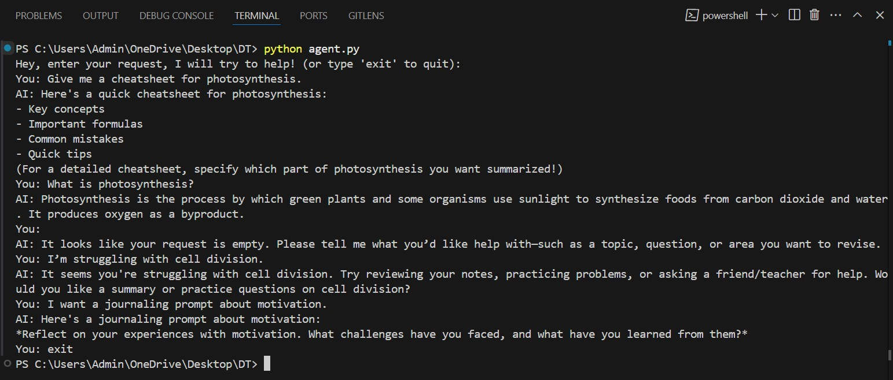

# Revision AI Agent

Welcome! This is a simple, interactive study assistant you can run on your computer. It answers questions, gives journaling prompts, helps you make study plans, and more—all in plain English.

## What does it do?

- **Understands what you ask:** Whether you want a quick answer, a study plan, or just something to think about, it figures out your intent.
- **Answers instantly:** It has a built-in knowledge base for common school topics and can use OpenAI (like ChatGPT) for more detailed answers if you set up an API key.
- **Remembers your last topic:** So conversations feel a bit more natural.
- **Gives clear, friendly responses:** No jargon, just helpful advice or information.

## How do I use it?

1. **Install Python** if you haven’t already (https://www.python.org/).
2. **(Optional) Get an OpenAI API key** if you want supercharged answers. [Get one here.](https://platform.openai.com/)
3. **Install the required package:**
   ```
   pip install openai
   ```
4. **Set your API key (optional):**
   - On Mac/Linux:
     ```
     export OPENAI_API_KEY="your_api_key_here"
     ```
   - On Windows:
     ```
     setx OPENAI_API_KEY "your_api_key_here"
     ```
5. **Run the program:**
   ```
   python ai_agent.py
   ```
6. **Type your questions or requests!** Try things like:
   - What is photosynthesis?
   - I want a journaling prompt about motivation.
   - Can you make a study plan for World War II?
   - I’m struggling with cell division.

Type `exit` or `quit` to leave.

## Example

```
You: What is gravity?
AI: Gravity is the force that attracts two bodies toward each other. On Earth, it gives weight to physical objects and causes them to fall toward the ground when dropped.
```

## Example Screenshot



## What can’t it do (yet)?

- It doesn’t remember things between sessions.
- It only talks to one user at a time.
- The built-in knowledge is limited to common school topics.

## License

MIT—use it, share it, improve it!

---

Have fun studying! If you have ideas or want to make it better, feel free to contribute.
